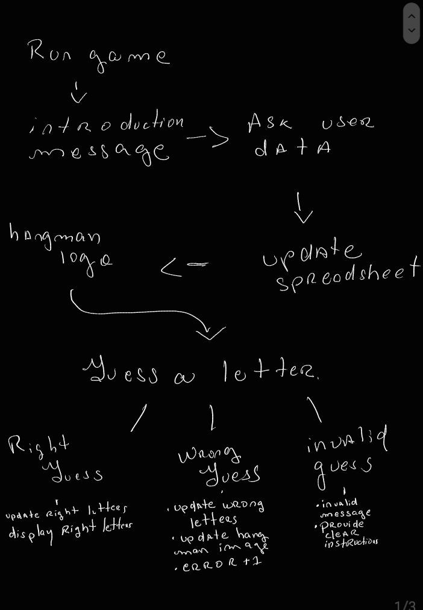
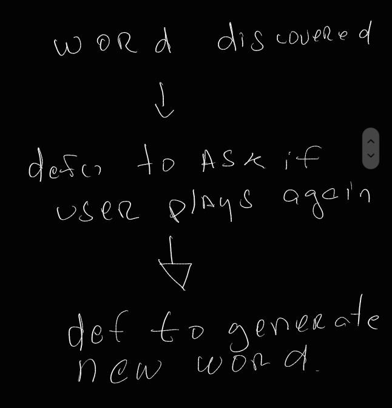
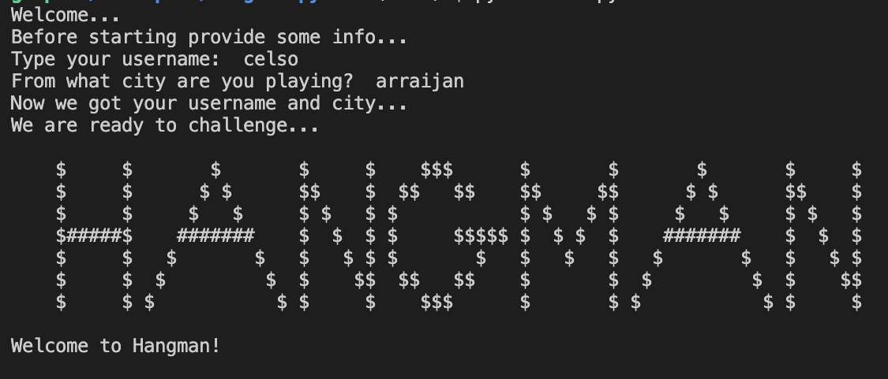
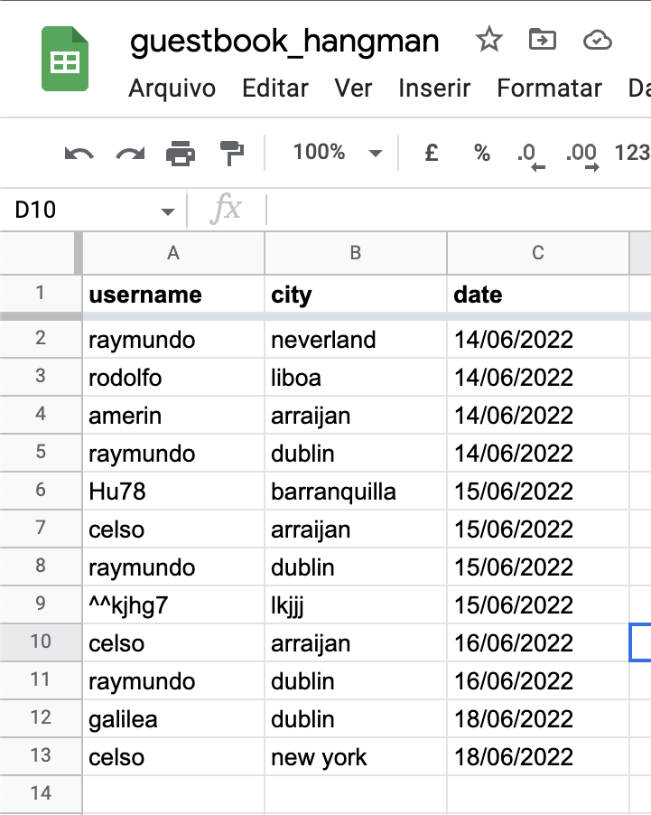
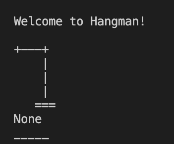
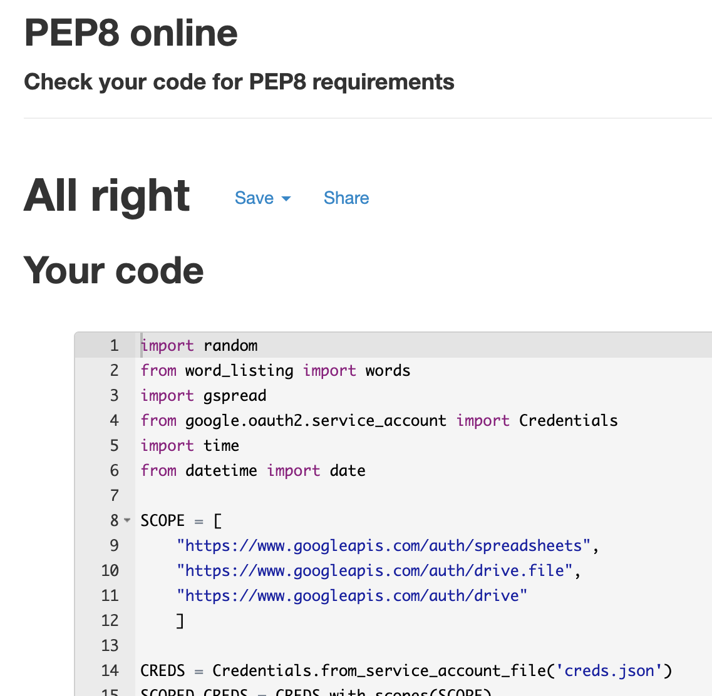

# Hangman Game

Student: Raymundo Castillo Moscarella

 [Live webpage](https://.herokuapp.com)

## Introduction

This is project milestone 3 of Code Institute program. I decided to develop a game based on Hangman. The purpose of the game is to guess letters of a random choosed word.

## Table of Content
* [User Experience](#user-experience)

* [Design](#design)
       
* [Technologies](#technologies)
    
* [Features](#features)
   
* [Validation](#validation)

* [Testing](#testing)

* [Bugs](#bugs)

* [Acknowledgements](#acknowledgements)

## User Experience
 
### User Stories
 
* As a first time user, I want to understand the display easily.
* As a first time user, I want to receive clear instructions.
* As a game user, I want to relate with the game I already know as hangman.
* As a game user, I want a simple game and easy to follow and understand.
 
### Site Owner Stories
 
The purpose of the site is to create a minimalistic app so users can play easily.

[Back](#table-of-content)

## Design
 
### Diagram
Please find screenshot of my diagram.
 

Diagram

 
[Back](#table-of-content)

## Technologies

### Languages
- Python, language used to develop the app.
 
### Resources
- GitHub used as recommended to store and backup projects and code as repository.
- Google APIs used to acess spreadsheets and create credentials.
- Google Sheets used to store information of guestbook.
- Heroku Platform used to deploy project.

### Libraries

 - Imported these libraries: 1. random 2. gspread 3. Credentials 4. time and 5. from datetime import date

[Back](#table-of-content)

## Features
 
### Logo and Intro Message
 

 
* When the users reach the website, they will see this message and the logo. User receive clear instructions. 

### Username
- Asks the player for their username.
- Asks the player for their city.
- Updates row (append) with input information.
 
### Guestbook

* The guestbook uses city and username input and append a row with the date.
 
### Game
- After logo is displayed, a welcome message appears.

- Displays if letter was already guessed.
- Displays right guess letters.
- Displays image of hangman and its progression.
 
[Back](#table-of-content)

## Testing

### Manual Testing
After testing user stories, I went ahead to run the program several times and asked close people to play it as well.
App runs with no issues.

### Validation
 
The PEP8 used as validator.
 

* No errors.

[Back](#table-of-content)

## Bugs
Main bugs issues were around where to declare variables.
After a few times I decided to declare word inside the game function.

Had a similar issue with the hangman image, as it displayed 2 times after each wrong guess. 

Other than this I had no major bugs.
 
[Back](#table-of-content)

## Acknowledgements
Love Sanwiches project structure and logic was my major reference.
I watched a big amount of tutorials to came up with my own version of hangman.
Slack community was very important to develop this project.
Thanks to all my friends who helped me test the game.

[Back](#table-of-content)